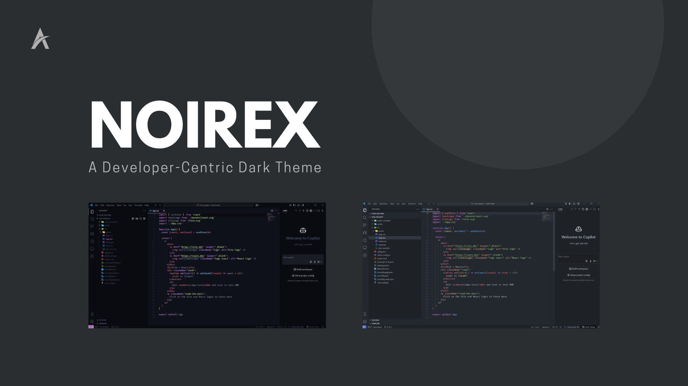

# Noirex - A Developer-Centric Dark Theme Crafted for Focus & Clarity

  

  
  
  
  
  

> **Noirex** is a refined dark theme extension for Visual Studio Code, designed with simplicity, contrast, and visual comfort in mind. Featuring two beautifully balanced variants—**Noirex** and **Noirex Dark**—it delivers a premium development experience across languages and environments.

## 🌌 Theme Variants

- **Noirex** — A modern dark theme with clean contrasts and subtle vibrancy.  
- **Noirex Dark** — A deeper, softer variation for low-light environments.

## ✨ Key Features

- 🎨 Clean and balanced syntax highlighting
- 🌙 Designed for both daytime and nighttime workflows
- 💻 Supports a wide range of languages and file types
- 🧠 Reduces visual fatigue during long coding sessions
- ⚡ Lightweight and optimized for performance

## 📥 Installation

### From Visual Studio Code

1. Open the Extensions sidebar (`Ctrl+Shift+X`)
2. Search for `Noirex`
3. Click **Install**
4. Open the Command Palette (`Ctrl+Shift+P`) → `Preferences: Color Theme`
5. Select `Noirex` or `Noirex Dark`

### From the Marketplace

👉 [Install Noirex from the Visual Studio Marketplace](https://marketplace.visualstudio.com/items?itemName=anexlab.noirex)

## 🔗 Project Links

- 🛍️ [Marketplace](https://marketplace.visualstudio.com/items?itemName=anexlab.noirex)  
- 🗂️ [GitHub Repository](https://github.com/anexlab/noirex)

## 🧩 Contributing

We welcome contributions and suggestions!

1. Fork this repository  
2. Create a new branch: `git checkout -b feature/your-feature`  
3. Commit your changes: `git commit -m "Add your feature"`  
4. Push the branch: `git push origin feature/your-feature`  
5. Open a Pull Request

## 📄 License

Released under the [MIT License](https://github.com/anexlab/noirex/blob/main/LICENSE).

## 🧠 About

**Noirex** is developed and maintained by [Anexlab](https://github.com/anexlab), an independent lab building developer-focused tools and themes with performance and clarity at the core.
